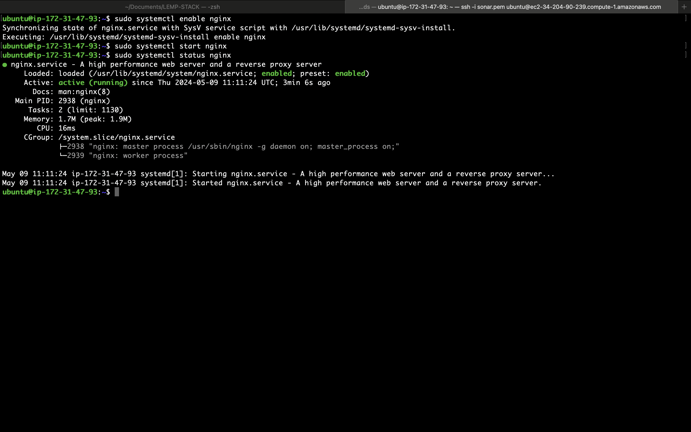
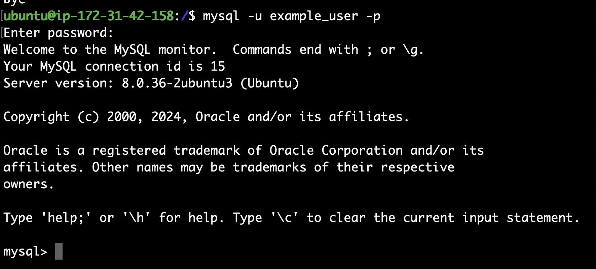

## WEB STACK IMPLEMENTATION (LEMP STACK) IN AWS

### Introduction

__The LEMP stack is a popular open-source web development platform that consists of four main components: Linux, Nginx, MySQL, and PHP (or sometimes Perl or Python). This documentation outlines the setup, configuration, and usage of the LEMP stack.__

## Step 0: Prerequisites

__1.__ EC2 Instance of t2.micro type and Ubuntu 24.04 LTS (HVM) was lunched in the us-east-1 region using the AWS console.

  


__2.__ Created SSH key pair named __"sonar.pem"__ to access the instance on port 22  


__3.__ The security group was configured with the following inbound rules:

- Allow traffic on port 80 (HTTP) with source from anywhere on the internet.
- Allow traffic on port 22 (SSH) with source from any IP address. This is opened by default.


__4.__ The default VPC and Subnet was used for the networking configuration.


__5.__ The private ssh key that got downloaded was located, permission was changed for the private key file and then used to connect to the instance by running

```
chmod 400 sonar.pem
```

```
ssh -i "sonar.pem" ubuntu@ec2-34-204-90-239.compute-1.amazonaws.com
```

Where __username=ubuntu__ and __public DNS ec2-34-204-90-239.compute-1.amazonaws.com__

## Step 1 - Install Nginx and Update the Firewall

__1.__ __Update and upgrade list of packages in package manager__

```
sudo apt update
sudo apt upgrade -y
```

__2.__ __Run apache2 package installation__

```
sudo apt install nginx -y
```


__3.__ __Enable and verify that nginx is running on as a service on the OS.__

```
sudo systemctl enable nginx
sudo systemctl status nginx
```

If it green and running, then nginx is correctly installed


__4.__ __The server is running and can be accessed locally in the ubuntu shell by running the command below:__

```
curl http://localhost:80
OR
curl http://127.0.0.1:80
```

__5.__ __Test with the public IP address if the Nginx  HTTP server can respond to request from the internet using the url on a browser.__

```
http://<public-ip>
```


This shows that the web server is correctly installed and it is accessible throuhg the firewall.

## Step 2 - Install MySQL

__1.__ __Install a relational database (RDB)__

MySQL was installed in this project. It is a popular relational database management system used within PHP environments.

```
sudo apt install mysql-server
```


When prompted, install was confirmed by typing y and then Enter.

__2.__ __Enable and verify that mysql is running with the commands below__

```
sudo systemctl enable --now mysql
sudo systemctl status mysql
```


__3.__ __Log in to mysql console__

```
sudo mysql
```

This connects to the MySQL server as the administrative database user __root__ infered by the use of __sudo__ when running the command.

__4.__ __Set a password for root user using mysql_native_password as default authentication method.__

Here, the user's password was defined as "password.mysql1"

```
ALTER USER 'root'@'localhost' IDENTIFIED WITH mysql_native_password BY 'password.mysql1';
```


Exit the MySQL shell

```
exit
```

__5.__ __Run an Interactive script to secure MySQL__

The security script comes pre-installed with mysql. This script removes some insecure settings and lock down access to the database system.

```
sudo mysql_secure_installation
```


Regardless of whether the VALIDATION PASSWORD PLUGIN is set up, the server will ask to select and confirm a password for MySQL root user.

__6.__ __After changing root user password, log in to MySQL console.__

A command prompt for password was noticed after running the command below.

```
sudo mysql -p
```


Exit MySQL shell

```
exit
```

## Step 3 - Install PHP

__1.__ __Install php__
Nginx is installed to serve the content and MySQL is installed to store and manage data.
PHP is the component of the set up that processes code to display dynamic content to the end user.

The following were installed:

- php-fpm
- php-mysql, a PHP module that allows PHP to communicate with MySQL-based databases.

```
sudo apt install php-fpm php-mysql -y
```


Confirm the PHP version

```
php -v
```


At this ponit, the LAMP stack is completely installed and fully operational.

## Step 4 - Configring Nginx to use PHP processor

When using the Nginx web server, we can create server blocks (similar to virtual hosts in Apache) to encapsulate configuration details and host more than one domain on a single server. In this guide, we will use projectLEMP as an example domain name.

On Ubuntu 20.04, Nginx has one server block enabled by default and is configured to serve documents out of a directory at /var/www/html. While this works well for a single site, it can become difficult to manage if you are hosting multiple sites. Instead of modifying /var/www/html, we’ll create a directory structure within /var/www for the your_domain website, leaving /var/www/html in place as the default directory to be served if a client request does not match any other sites.

__Create the root web directory for your_domain as follows:__

```
sudo mkdir /var/www/projectLEMP
```


__Next, assign ownership of the directory with the $USER environment variable, which will reference your current system user:__

```
sudo chown -R $USER:$USER /var/www/projectLEMP
```

__Then, open a new configuration file in Nginx’s sites-available directory using your preferred command-line editor. Here, we’ll use nano:__

```
sudo nano /etc/nginx/sites-available/projectLEMP
```

__This will create a new blank file. Paste in the following bare-bones configuration:__

```
#/etc/nginx/sites-available/projectLEMP

server {
    listen 80;
    server_name projectLEMP www.projectLEMP;
    root /var/www/projectLEMP;

    index index.html index.htm index.php;

    location / {
        try_files $uri $uri/ =404;
    }

    location ~ \.php$ {
        include snippets/fastcgi-php.conf;
        fastcgi_pass unix:/var/run/php/php8.1-fpm.sock;
     }

    location ~ /\.ht {
        deny all;
    }

}
```


__When you’re done editing, save and close the file. If you’re using nano, you can do so by typing CTRL+X and then y and ENTER to confirm.__

__Activate your configuration by linking to the config file from Nginx’s sites-enabled directory:__

```
sudo ln -s /etc/nginx/sites-available/projectLEMP /etc/nginx/sites-enabled/
```

__This will tell Nginx to use the configuration next time it is reloaded. You can test your configuration for syntax errors by typing:__

```
sudo nginx -t
````

You shall see following message:


__We also need to disable default Nginx host that is currently configured to listen on port 80, for this run:__

```
sudo unlink /etc/nginx/sites-enabled/default
```

Then reload/restart nginx to apply the changes

```
sudo systemctl reload nginx
```

__The new website is now active, but the web root /var/www/projectLEMP is still empty. we will Create an index.html file in that location so that we can test that the  new server block works as expected:__

Before that we will have to modify the instance metadata options in the instance settings.


Click save after changine the IMDSv2 option to optional.

__Then will run this command__

```
sudo echo 'Hello LEMP from hostname' $(curl -s http://169.254.169.254/latest/meta-data/public-hostname) 'with public IP' $(curl -s http://169.254.169.254/latest/meta-data/public-ipv4) > /var/www/projectLEMP/index.html
```

__Now go to your browser and try to open your website URL using IP address or Public DNS:__

```
http://<Public-IP-Address>:80
```


__You can leave this file in place as a temporary landing page for your application until you set up an index.php file to replace it. Once you do that, remember to remove or rename the index.html file from your document root, as it would take precedence over an index.php file by default.__

__Your LEMP stack is now fully configured. In the next step, we’ll create a PHP script to test that Nginx is in fact able to handle .php files within your newly configured website.__

## Step 5 – Testing PHP with Nginx

My LEMP stack is now be completely set up.  
I'm going to  test it to validate that Nginx can correctly hand .php files off to my PHP processor.  
So i'm going to create a test file in my vim editor.  

```
sudo vim /var/www/projectLEMP/info.php
```

**Type or paste the following lines into the new file. This is valid PHP code that will return information about your server:**
```
<?php
phpinfo();
```


You can now access this page in your web browser by visiting the domain name or public IP address you’ve set up in your Nginx configuration file, followed by /info.php:

```
http://`server_domain_or_IP`/info.php
```

After checking the relevant information about your PHP server through that page, it’s best to remove the file you created as it contains sensitive information about your PHP environment and your Ubuntu server. You can use rm to remove that file:

```
sudo rm /var/www/your_domain/info.php
```

## Step 6 — Retrieving data from MySQL database with PHP

We will create a database named example_database and a user named example_user, but you can replace these names with different values.

First, connect to the MySQL console using the root account:

```
sudo mysql
```

To create a new database, run the following command from your MySQL console:

```
mysql> CREATE DATABASE `example_database`;
```

Now you can create a new user and grant him full privileges on the database you have just created.  

The following command creates a new user named example_user, using mysql_native_password as default authentication method. We’re defining this user’s password as PassWord.1,

```
CREATE USER 'example_user'@'%' IDENTIFIED WITH mysql_native_password BY 'PassWord.1';
```


Now we need to give this user permission over the example_database database:
```
GRANT ALL ON example_database.* TO 'example_user'@'%';
```

This will give the example_user user full privileges over the example_database database, while preventing this user from creating or modifying other databases on your server.

Now exit the MySQL shell with:

```
mysql> exit
```

You can test if the new user has the proper permissions by logging in to the MySQL console again, this time using the custom user credentials:
```
mysql -u example_user -p
```


Now that we have access to the  example_database Database:

```
mysql> SHOW DATABASES;
```

__This will give you the following output:__


__Next, we’ll create a test table named todo_list. From the MySQL console, run the following statement:__

```
CREATE TABLE example_database.todo_list (
    item_id INT AUTO_INCREMENT,
    content VARCHAR(255),
    PRIMARY KEY(item_id)
);

```

Now let Insert a few rows of content in the test table. we will repeat the next command a few times, using different VALUES:

```
INSERT INTO example_database.todo_list (content) VALUES ("My first important item");
```


To confirm that the data was successfully saved to your table, run:
```
mysql>  SELECT * FROM example_database.todo_list;
```

You’ll see the following output:


__Then exit the mysql console.__
```
mysql> exit
```

Now we can create a PHP script that will connect to MySQL and query for your content. Create a new PHP file in your custom web root directory using your preferred editor. We’ll use vi for that:

```
nano /var/www/projectLEMP/todo_list.php
```

Then we will write the following script into todo_list.php: 


Save and close the file when you are done editing  


You can now access this page in your web browser by visiting the domain name or public IP address configured for your website, followed by /todo_list.php:  

```
http://<Public_domain_or_IP>/todo_list.php
```

You should see a page like this, showing the content you’ve inserted in your test table:


That means your PHP environment is ready to connect and interact with your MySQL server.

## xCongratulations!
In this guide , we have built a flexible foundation for serving PHP websites and applications to your visitors, using Nginx as web server and MySQL as database management system.

